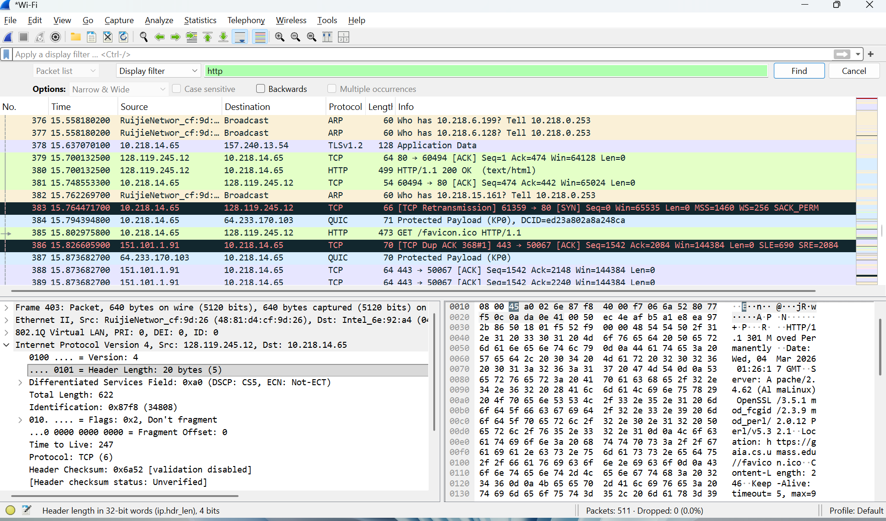
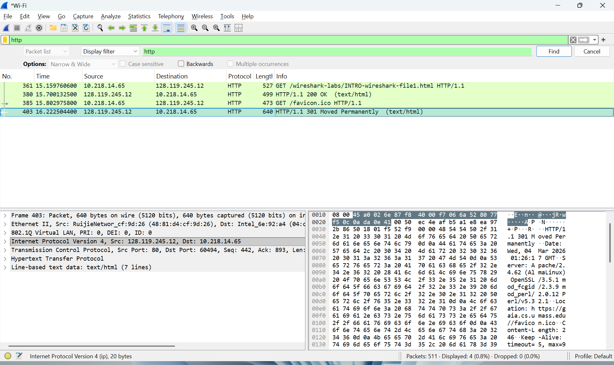
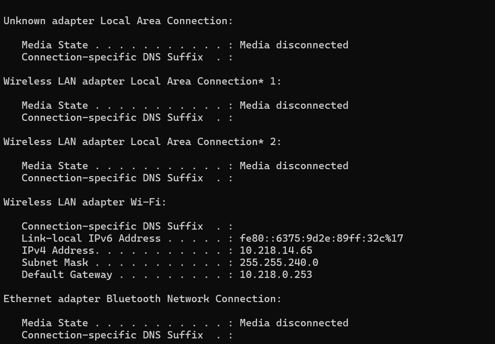

# Laporan Praktikum Jarkom IF

# Tujuan
Praktikum ini bertujuan untuk memahami cara kerja protokol HTTP (Hypertext Transfer Protocol) dalam komunikasi jaringan dengan menggunakan aplikasi Wireshark untuk menangkap dan menganalisis paket data yang dikirim antara client dan server

Website yang digunakan adalah 
http://gaia.cs.umass.edu/wireshark-labs/INTRO-wireshark-file1.html

## Langkah-Langkah Praktikum
1. Mengecek Konfigurasi IP Address menggunakan ipconfig
- IPv4 Address (10.218.14.65)
Merupakan alamat IP komputer yang digunakan sebagai client dalam komunikasi jaringan
- Default Gateway (10.218.0.253)
Merupakan alamat router yang digunakan untuk menghubungkan jaringan lokal dengan jaringan luar (internet)
2. Membuka Wireshark dan Memilih Interface dan memilih interface jaringan Wi-Fi karena komputer terhubung ke internet melalui Wi-Fi
3. Menggunakan Filter HTTP untuk menampilkan hanya paket HTTP saja, sehingga lebih mudah dianalisis
4. Mengakses Website Percobaan, Ketika halaman tersebut dibuka, browser akan mengirim HTTP Request ke server dan server akan mengirim HTTP Response kembali ke client

## Lampiran
Hasil Percobaan :

