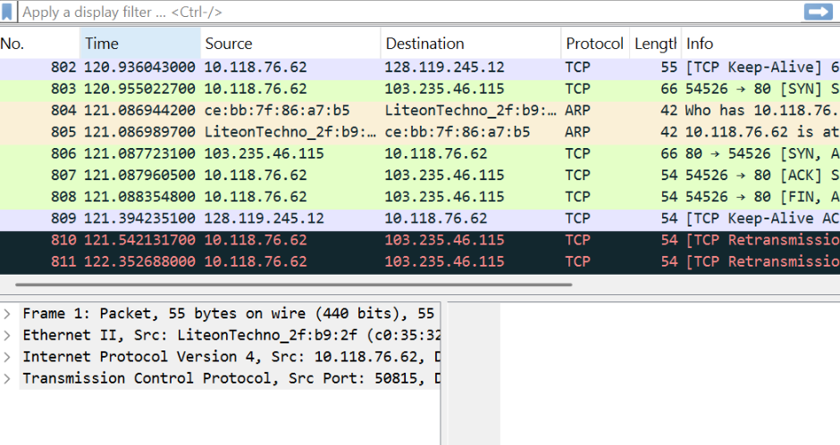
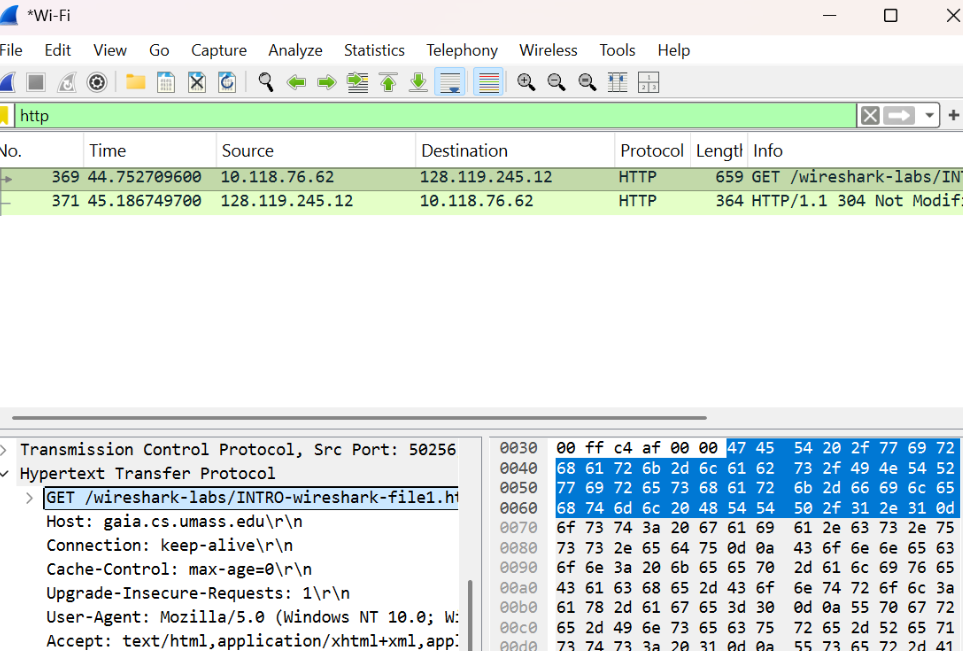
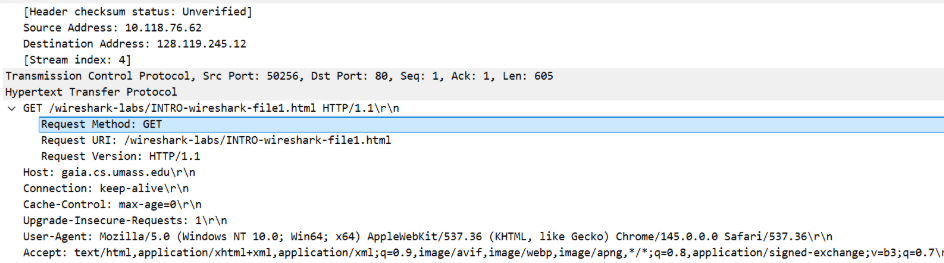

# Laporan Praktikum Jaringan Komputer - Modul 2
## Analisis Protokol Jaringan Menggunakan Wireshark

---

### **Identitas Praktikan**
| Detail Mahasiswa | Informasi |
| :--- | :--- |
| **Nama** | Annisa Nur Shadrina |
| **NIM** | 103072400134 |
| **Kelas** | IF-04-02 |

---

### **1. Tujuan Praktikum**
Berdasarkan panduan praktikum Jaringan Komputer, sasaran utama dari pelaksanaan Modul 2 ini adalah:
1. **Persiapan Perangkat:** Mahasiswa mampu melakukan instalasi dan konfigurasi dasar perangkat lunak **Wireshark**.
2. **Operasionalisasi Sniffing:** Mahasiswa mampu mengoperasikan fitur-fitur utama Wireshark untuk melakukan penyadapan (*capturing*) dan identifikasi paket data pada jaringan aktif secara *real-time*.
3. **Analisis Protokol:** Mahasiswa dapat memahami struktur enkapsulasi data pada model OSI melalui observasi paket.

---

### **2. Landasan Teori**

#### **2.1 Mekanisme Kerja Packet Sniffer**
Wireshark bekerja sebagai *Packet Sniffer*, sebuah instrumen yang berfungsi untuk mengamati pertukaran data antar entitas protokol secara pasif. Alat ini menyalin setiap pesan (frame) yang melintasi antarmuka jaringan tanpa melakukan modifikasi atau intervensi terhadap arus data aslinya.

Fungsionalitas *Packet Sniffer* ditopang oleh dua komponen utama:
* **Capture Library:** Bertugas mengamankan salinan dari setiap unit data pada lapisan fisik yang dideteksi oleh Network Interface Card (NIC).
* **Packet Analyzer:** Bertugas menguraikan seluruh *field* dalam pesan protokol berdasarkan standar internasional (seperti Ethernet, IP, TCP, dan HTTP).

#### **2.2 Komponen Antarmuka Wireshark**
Antarmuka Wireshark dirancang untuk memudahkan analisis mendalam melalui beberapa panel utama:
1. **Packet Listing:** Menampilkan daftar kronologis paket yang tertangkap beserta informasi ringkas (No, Time, Source, Destination, Protocol).
2. **Packet Header Details:** Menyajikan rincian setiap lapisan protokol (Layer 2 hingga Layer 7) dalam bentuk hierarki yang dapat diekspansi.
3. **Packet Contents:** Menampilkan data mentah (payload) dalam format heksadesimal dan representasi ASCII.
4. **Display Filter:** Memungkinkan pengguna untuk menyaring trafik berdasarkan kriteria spesifik (misal: hanya menampilkan protokol HTTP).

---

### **3. Prosedur Pelaksanaan**

1. **Inisialisasi:** Menyiapkan koneksi internet dan menjalankan aplikasi Wireshark serta web browser.
2. **Pemilihan Interface:** Mengidentifikasi *interface* jaringan yang aktif (Wi-Fi atau Ethernet) yang memiliki aktivitas trafik.
3. **Capturing:** Memulai proses perekaman data melalui menu `Capture` > `Start`.
4. **Generating Traffic:** Mengakses URL target `http://gaia.cs.umass.edu/wireshark-labs/INTRO-wireshark-file1.html` untuk memicu pertukaran paket HTTP.
5. **Filtrasi & Analisis:** Menghentikan *capture*, menerapkan filter `http`, dan membedah struktur paket `HTTP GET` yang ditemukan.

---

### **4. Analisis Hasil Pengamatan**

#### **4.1 Aktivasi Interface dan Proses Capturing**
Pada tahap awal, Wireshark diatur untuk menangkap trafik dari antarmuka Wi-Fi. Gambar di bawah menunjukkan kondisi saat Wireshark sudah mulai merekam berbagai macam paket yang melintasi jaringan, termasuk trafik dari berbagai protokol latar belakang sebelum filter diterapkan.

#### **4.2 Identifikasi Paket dalam Daftar (Packet List Control)**
Daftar paket yang tertangkap menunjukkan volume trafik yang cukup tinggi. Setiap baris mewakili satu paket data yang berisi informasi alamat IP sumber dan tujuan. Identifikasi ini sangat penting untuk memisahkan trafik antara perangkat lokal dengan server eksternal.

#### **4.3 Implementasi Display Filter HTTP**
Untuk memudahkan analisis protokol spesifik, diterapkan filter `http`. Hasilnya, hanya paket-paket yang berkaitan dengan protokol Hypertext Transfer Protocol yang ditampilkan. Hal ini mempermudah identifikasi paket `GET` yang dikirim oleh browser kita dan respon dari server.

#### **4.4 Dekomposisi Struktur Protokol HTTP GET**
Analisis mendalam pada paket `HTTP GET` menunjukkan struktur enkapsulasi yang lengkap:
* **Ethernet II:** Menunjukkan alamat MAC (media access control) perangkat.
* **Internet Protocol (IPv4):** Menunjukkan alamat IP sumber (laptop praktikan) dan tujuan (server gaia.cs.umass.edu).
* **Transmission Control Protocol (TCP):** Menangani transport data pada port 80 (standard HTTP).
* **Hypertext Transfer Protocol:** Memuat instruksi aplikasi seperti jenis browser (User-Agent) dan file yang diminta.

---

### **5. Kesimpulan**
Setelah melaksanakan praktikum Modul 2, dapat disimpulkan bahwa:
1. **Visualisasi Protokol:** Wireshark sangat efektif dalam memvisualisasikan bagaimana data dikemas (enkapsulasi) dari lapisan aplikasi hingga lapisan fisik.
2. **Efisiensi Analisis:** Fitur *Display Filter* merupakan instrumen krusial bagi administrator jaringan untuk mengaudit trafik tertentu di tengah ribuan paket lainnya.
3. **Pemahaman Layering:** Praktikum ini memperjelas konsep *layering* pada protokol komunikasi, di mana setiap protokol bergantung pada layanan protokol di bawahnya untuk pengiriman data yang sukses.
4. **Kesiapan Teknis:** Praktikan kini memiliki kompetensi dasar dalam menggunakan *packet sniffer* sebagai langkah awal untuk *troubleshooting* jaringan atau audit keamanan informasi.
