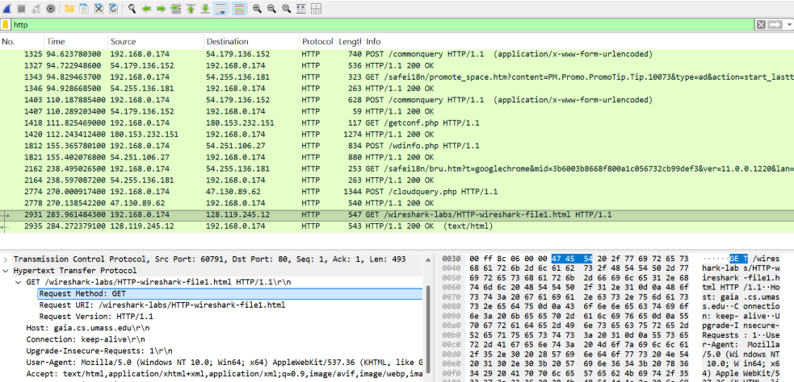
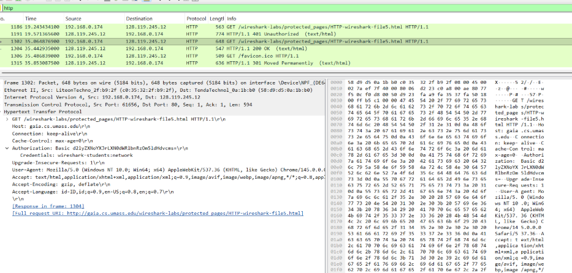

# Laporan Praktikum Jaringan Komputer - Modul 3
## Investigasi Protokol HTTP Secara Mendalam dengan Wireshark

---

### **Identitas Praktikan**
| Detail Mahasiswa | Informasi |
| :--- | :--- |
| **Nama** | Annisa Nur Shadrina |
| **NIM** | 103072400134 |
| **Kelas** | IF-04-02 |

---

### **1. Tujuan Praktikum**
Pelaksanaan praktikum Modul 3 bertujuan untuk:
1. **Analisis Struktur Pesan:** Menginvestigasi struktur pesan HTTP Request (GET) dan HTTP Response secara mendalam.
2. **Optimasi Jaringan:** Memahami mekanisme *Conditional GET* dan pengelolaan *browser cache* untuk efisiensi penggunaan bandwidth.
3. **Mekanisme Transport:** Menganalisis bagaimana protokol TCP di lapisan transport melakukan segmentasi dan penyusunan kembali (*reassembly*) pada dokumen berukuran besar.

---

### **2. Landasan Teori**

#### **2.1 Protokol HTTP (Hypertext Transfer Protocol)**
HTTP merupakan protokol pada lapisan aplikasi yang menggunakan model *request-response*. Protokol ini bersifat *stateless*, artinya setiap transaksi permintaan diperlakukan sebagai entitas independen tanpa menyimpan informasi dari transaksi sebelumnya.

#### **2.2 Interaksi HTTP dan TCP**
Dalam operasionalnya, HTTP mengandalkan protokol TCP pada lapisan transport untuk menjamin pengiriman data yang andal (*reliable*). Beberapa mekanisme krusial yang diamati meliputi:
* **Conditional GET:** Fitur validasi konten menggunakan header `If-Modified-Since`. Jika data di server belum berubah, server cukup mengirimkan kode status `304 Not Modified`, sehingga browser menggunakan salinan lokal (cache).
* **Segmentation:** Proses pemecahan data aplikasi yang besar ke dalam beberapa segmen TCP karena adanya batasan *Maximum Segment Size* (MSS) pada jaringan.
* **HTTP Authentication:** Skema keamanan dasar di mana informasi kredensial dikirimkan dalam format *Base64 encoding* melalui header `Authorization`.

---

### **3. Prosedur Pelaksanaan**

1. **Persiapan Filter:** Menjalankan Wireshark dan menerapkan filter `http` untuk mengisolasi trafik web.
2. **Pembersihan Cache:** Melakukan *Clear Browser Cache* untuk memastikan data diunduh langsung dari server pada percobaan awal.
3. **Pengujian Basic:** Mengunduh file HTML sederhana untuk membedah struktur header.
4. **Uji Caching:** Melakukan *refresh* pada halaman yang sama untuk mematikan mekanisme `Conditional GET`.
5. **Analisis Data Besar:** Mengakses file teks berukuran besar (>4000 bytes) untuk mengamati segmentasi PDU (Protocol Data Unit).
6. **Audit Keamanan:** Mengakses halaman web dengan autentikasi untuk memeriksa pengiriman kredensial.

---

### **4. Analisis Hasil Pengamatan**

#### **4.1 Interaksi Dasar HTTP GET/Response**
Pada tahap ini, dilakukan observasi terhadap paket HTTP GET yang dikirimkan browser. Paket ini memuat rincian identitas browser (*User-Agent*) dan jenis konten yang dapat diterima (*Accept*).

**Analisis:** Server merespons dengan status `200 OK`, menandakan permintaan berhasil diproses dan data dikirimkan sepenuhnya. Semua informasi ini ditransmisikan dalam format *plain-text* pada port standar 80.

#### **4.2 Implementasi HTTP Conditional GET**
Pengamatan pada akses berulang menunjukkan efisiensi protokol HTTP melalui fitur *caching*.

**Analisis:** Browser menyertakan header `If-Modified-Since` pada permintaan kedua. Karena konten di server tidak mengalami perubahan sejak waktu tersebut, server merespons dengan `304 Not Modified`. Hal ini secara efektif menghilangkan kebutuhan untuk mengirim ulang isi file yang sama, sehingga menghemat konsumsi bandwidth.

#### **4.3 Penanganan Segmentasi Segmen TCP**
Saat mengunduh file dengan ukuran besar, ditemukan fenomena segmentasi pada lapisan transport.

**Analisis:** Terlihat beberapa paket dengan keterangan `[TCP segment of a reassembled PDU]`. Hal ini membuktikan bahwa data aplikasi yang besar tidak dikirim dalam satu paket tunggal, melainkan dipecah menjadi beberapa segmen sesuai batasan jaringan, dan baru digabungkan kembali oleh lapisan aplikasi di sisi penerima.

#### **4.4 Keamanan pada HTTP Basic Authentication**
Analisis dilakukan pada akses halaman yang memerlukan login untuk meninjau aspek keamanan data.

**Analisis:** Setelah pengguna memasukkan kredensial, muncul header `Authorization: Basic`. Meskipun string yang terlihat tampak acak, sebenarnya itu hanyalah format Base64 yang sangat mudah didekode kembali menjadi username dan password asli. Hal ini menunjukkan kerentanan HTTP biasa terhadap serangan penyadapan (*sniffing*).

---

### **5. Kesimpulan**
Dari serangkaian pengujian pada Modul 3, dapat disimpulkan bahwa:
1. **Sinergi Layer:** Protokol HTTP bergantung sepenuhnya pada mekanisme TCP untuk menangani data besar melalui proses segmentasi dan *reassembly*.
2. **Efisiensi Protokol:** Mekanisme *Conditional GET* sangat krusial dalam mengurangi beban trafik pada infrastruktur jaringan global.
3. **Aspek Keamanan:** Penggunaan HTTP standar tanpa enkripsi (seperti SSL/TLS pada HTTPS) sangat berisiko tinggi karena data sensitif seperti kredensial login dikirimkan dalam format yang mudah dibaca oleh pihak tidak bertanggung jawab.