•	Berdasarkan hasil perintah ipconfig, perangkat yang digunakan memiliki IPv4 Address 10.218.9.196 dengan Subnet Mask 255.255.240.0.
•	Hasil perintah nslookup gaia.cs.umass.edu menunjukkan bahwa alamat IP dari server tujuan adalah 128.119.245.12.
•	Resolusi nama dilakukan melalui DNS server kampus dengan alamat 10.217.7.77 
•	Paket 1 (SYN): Client mengirim pesan inisiasi dengan Sequence Number 0.
•	Paket 2 (SYN, ACK): Server membalas dengan flag SYN dan ACK aktif, serta Acknowledgement Number 1.
•	Paket 3 (ACK): Client mengirimkan ACK terakhir untuk menandakan koneksi TCP telah siap (Established)
•	Setelah koneksi TCP terbentuk, client mengirimkan permintaan HTTP POST ke alamat /ethereal-labs/lab3-1-reply.htm di server gaia.cs.umass.edu.
•	Tujuannya adalah untuk mengunggah file bernama alice.txt.
•	Dapat dilihat pada detail header bahwa ukuran data yang dikirim (Content-Length) adalah 163.411 bytes.
•	Karena file yang dikirim cukup besar, protokol TCP memecah data tersebut menjadi segmen-segmen kecil agar bisa ditransmisikan.
•	Setiap segmen memiliki ukuran sekitar 1460 bytes (sesuai nilai MSS).
•	Keterangan "[TCP PDU reassembled in 199]" menunjukkan bahwa Wireshark berhasil menyatukan kembali segmen-segmen tersebut ke dalam satu pesan HTTP yang utuh
•	Grafik ini menampilkan nilai Round Trip Time (RTT) untuk setiap segmen TCP yang dikirim dari alamat 192.168.1.102 ke 128.119.245.12.
•	RTT adalah waktu yang dibutuhkan paket untuk sampai ke tujuan dan menerima balasan kembali.
•	Terlihat fluktuasi waktu respon berkisar antara 50 ms hingga lebih dari 250 ms selama masa transmisi data
•	Grafik Sequence Numbers (Stevens) menunjukkan volume data yang berhasil dikirimkan seiring berjalannya waktu.
•	Garis diagonal yang lurus dan konsisten naik menunjukkan bahwa proses transmisi data berlangsung dengan lancar tanpa adanya kehilangan paket (packet loss) atau retransmisi yang signifikan.
•	Total data yang dikirimkan mencapai kisaran 164 KB dalam waktu sekitar 5 detik

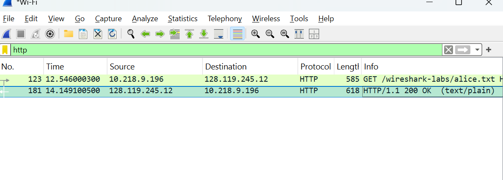
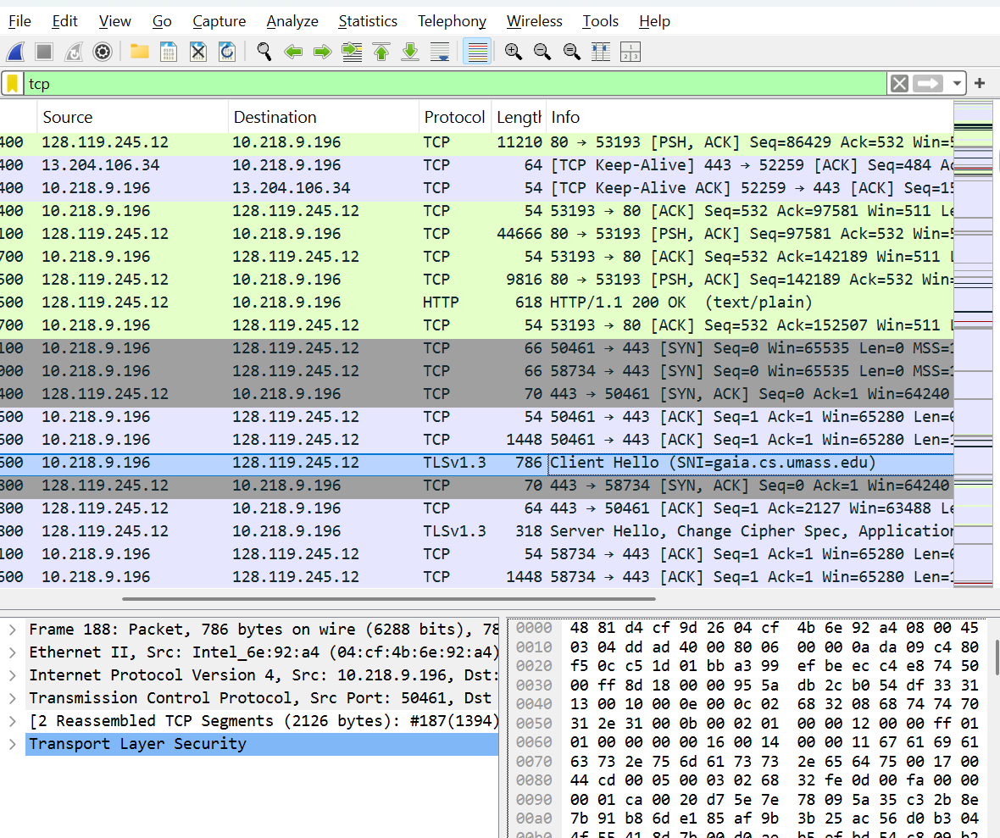
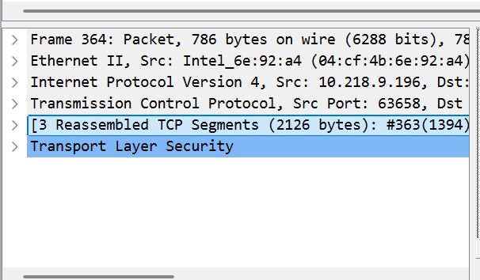
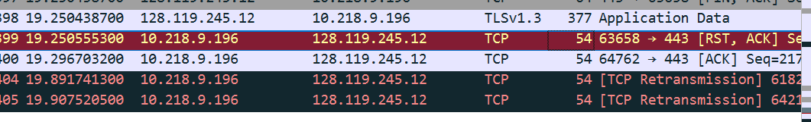
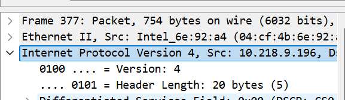
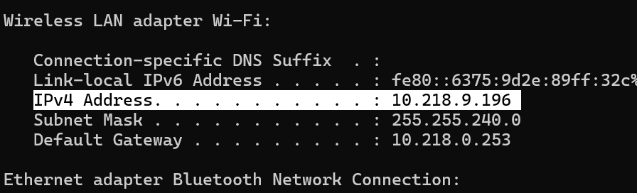
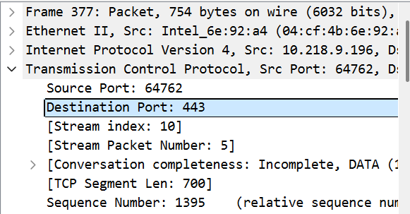
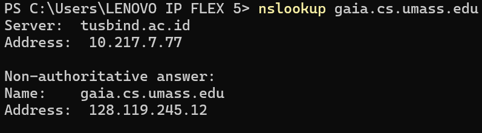
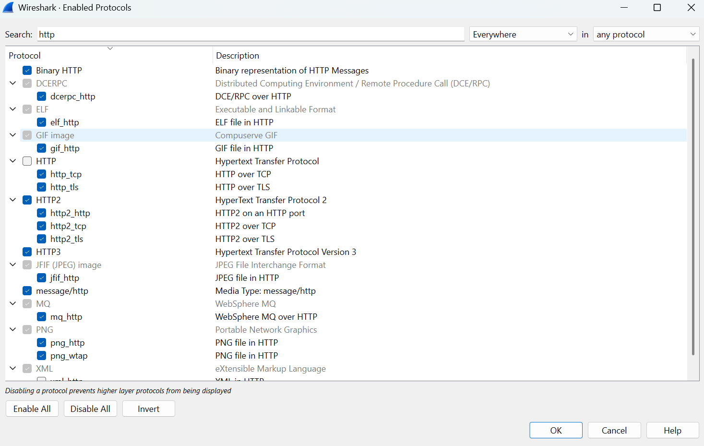
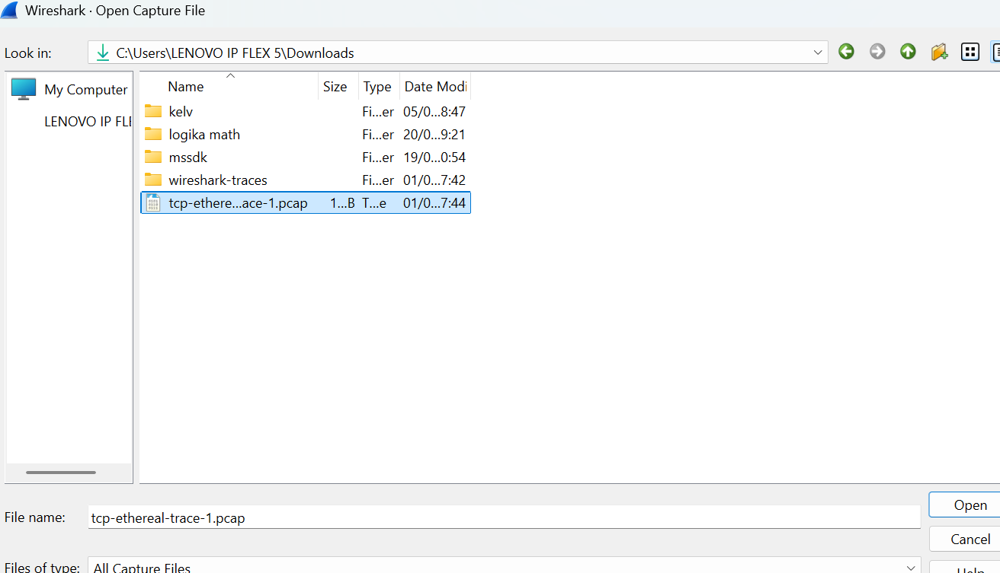
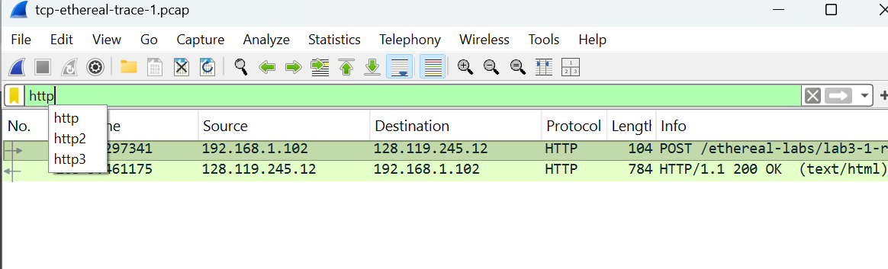
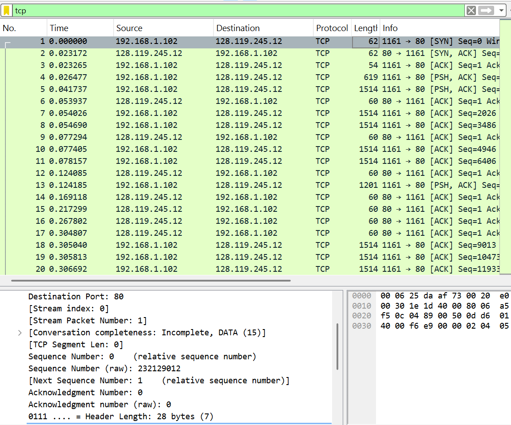
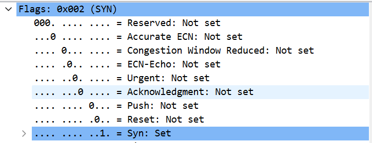
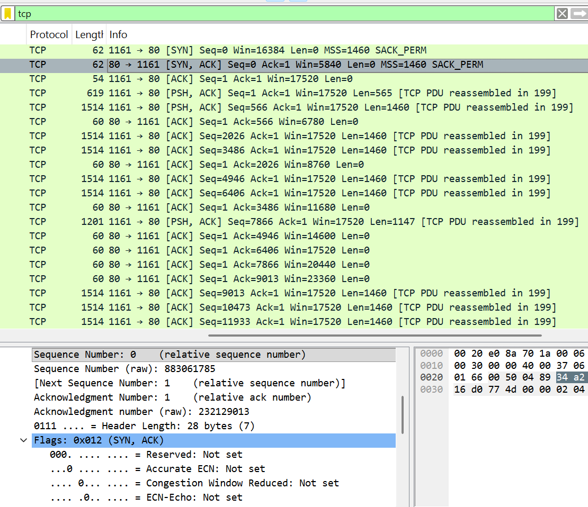
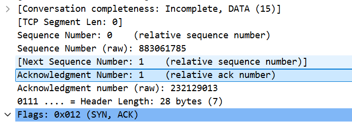
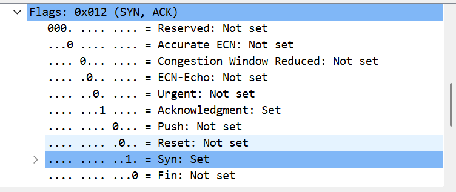
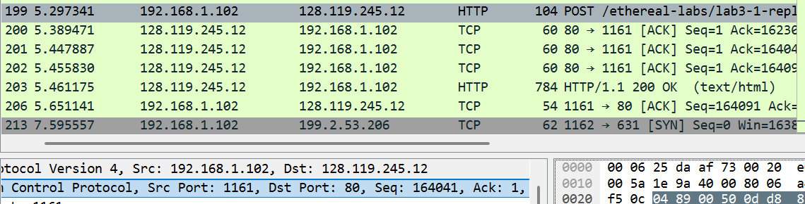
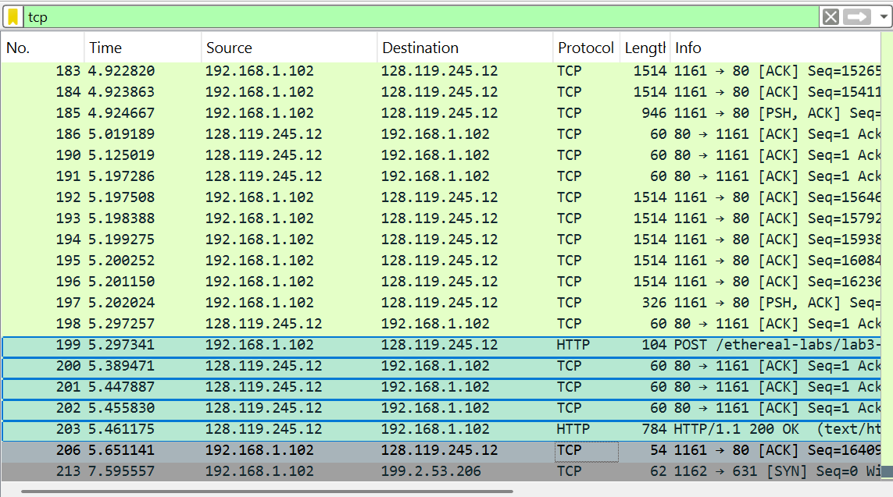
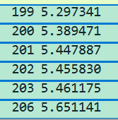
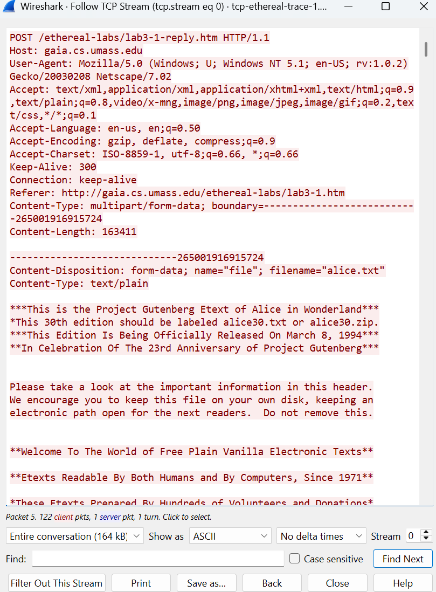
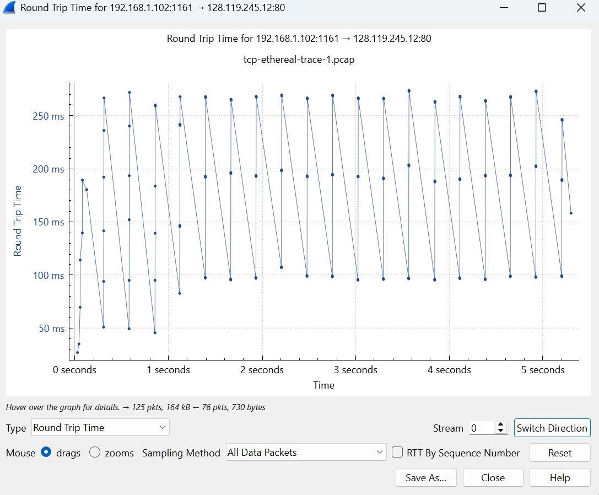
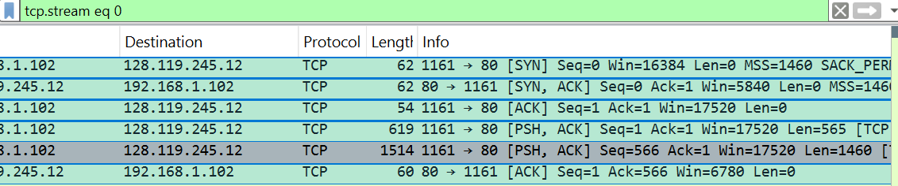
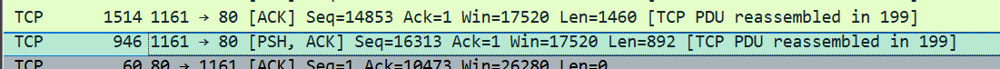
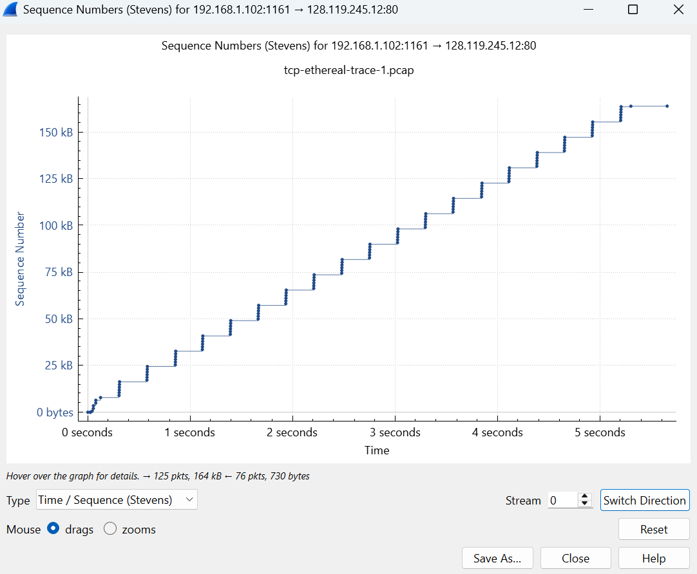

